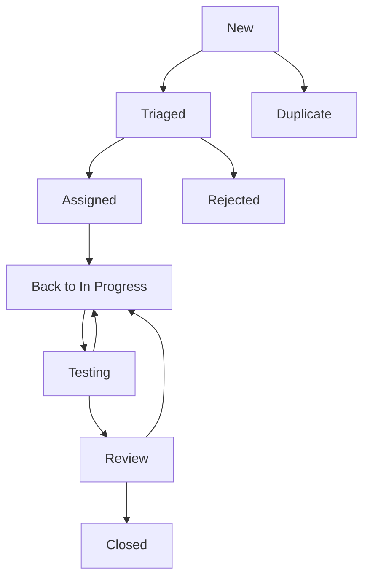

# Issue Tracking System - OHIF Enhanced Features

## 🎯 **Issue Tracking Overview**

This comprehensive issue tracking system manages the complete lifecycle of defects, enhancement requests, and improvement opportunities discovered during testing and validation of OHIF Enhanced Features. The system provides structured processes for logging, prioritizing, tracking, and resolving issues while maintaining clear communication with all stakeholders.

### 🔍 **System Objectives**

#### Primary Goals
- **Defect Management**: Systematic tracking and resolution of software defects
- **Enhancement Tracking**: Management of feature enhancement requests and improvements
- **Priority Management**: Intelligent prioritization based on severity, impact, and business value
- **Stakeholder Communication**: Clear communication channels for issue status and resolution
- **Quality Assurance**: Continuous improvement through systematic issue analysis

#### Secondary Goals
- **Trend Analysis**: Pattern recognition and root cause analysis
- **Process Improvement**: Continuous refinement of testing and development processes
- **Risk Mitigation**: Early identification and mitigation of project risks
- **Knowledge Management**: Documentation and sharing of solutions and best practices

---

## 📊 **Issue Classification System**

### Issue Types

| Type | Description | Examples | Typical Priority |
|------|-------------|----------|------------------|
| **Bug** | Software defects affecting functionality | Virtual series not loading, toolbar crashes | High to Critical |
| **Enhancement** | Feature improvements and optimizations | UI improvements, performance optimizations | Medium to High |
| **Documentation** | Documentation issues and gaps | Missing user guides, unclear instructions | Low to Medium |
| **Security** | Security vulnerabilities and concerns | Data exposure, authentication issues | High to Critical |
| **Performance** | Performance-related issues | Slow loading, memory leaks | Medium to High |
| **Usability** | User experience and accessibility issues | Confusing UI, accessibility barriers | Medium |
| **Compatibility** | Browser/platform compatibility issues | Browser-specific bugs, OS compatibility | Medium to High |
| **Infrastructure** | System infrastructure and deployment issues | CI/CD failures, environment issues | Medium to High |

### Severity Levels

| Severity | Definition | Examples | Response Time |
|----------|------------|----------|---------------|
| **Critical** | System unusable, blocks core functionality | Application crashes, data corruption | 4 hours |
| **High** | Major functionality affected, workarounds difficult | Enhanced features non-functional, significant performance degradation | 24 hours |
| **Medium** | Moderate impact, workarounds available | Minor feature issues, cosmetic problems | 72 hours |
| **Low** | Minor impact, cosmetic or documentation issues | Typos, minor UI inconsistencies | 1 week |

### Priority Matrix

| Impact | High User Impact | Medium User Impact | Low User Impact |
|--------|------------------|-------------------|-----------------|
| **High Frequency** | Critical Priority | High Priority | Medium Priority |
| **Medium Frequency** | High Priority | Medium Priority | Low Priority |
| **Low Frequency** | Medium Priority | Low Priority | Low Priority |

---

## 🔄 **Issue Lifecycle Management**

### Issue States



#### State Definitions

1. **New**: Issue reported but not yet reviewed
2. **Triaged**: Issue reviewed, prioritized, and categorized
3. **Assigned**: Issue assigned to team member for resolution
4. **In Progress**: Active work being performed on the issue
5. **Testing**: Fix implemented and under testing
6. **Review**: Solution under code/quality review
7. **Closed**: Issue resolved and verified
8. **Rejected**: Issue determined invalid or out of scope
9. **Duplicate**: Issue identified as duplicate of existing issue

### Workflow Process

#### 1. Issue Discovery and Reporting
- **Automated Detection**: Issues discovered through automated testing frameworks
- **Manual Reporting**: Issues found during manual testing or user feedback
- **Monitoring Alerts**: Issues identified through performance monitoring
- **Stakeholder Feedback**: Issues reported by clinical users or stakeholders

#### 2. Initial Triage (Within 24 hours)
- **Validation**: Verify issue reproducibility and legitimacy
- **Classification**: Assign type, severity, and initial priority
- **Assignment**: Route to appropriate team member or specialist
- **Documentation**: Ensure complete issue description and context

#### 3. Investigation and Analysis
- **Root Cause Analysis**: Identify underlying causes
- **Impact Assessment**: Evaluate scope and business impact
- **Solution Planning**: Develop approach for resolution
- **Effort Estimation**: Estimate time and resources required

#### 4. Resolution Implementation
- **Development**: Implement fix or enhancement
- **Code Review**: Peer review of changes
- **Testing**: Validate solution against acceptance criteria
- **Documentation**: Update relevant documentation

#### 5. Verification and Closure
- **Validation Testing**: Confirm issue resolution
- **Regression Testing**: Ensure no new issues introduced
- **Stakeholder Approval**: Obtain necessary approvals
- **Issue Closure**: Update issue status and document resolution

---

## 📋 **Issue Templates and Standards**

### Bug Report Template

```markdown
# Bug Report

## Summary
Brief description of the issue

## Environment
- **Browser**: Chrome 120.x / Firefox 119.x / Safari 17.x
- **OS**: Windows 11 / macOS 14 / Ubuntu 22.04
- **OHIF Version**: v3.x.x with Enhanced Features
- **Study Type**: CT / MR / CR / US / Multi-modal

## Steps to Reproduce
1. Navigate to...
2. Click on...
3. Perform action...
4. Observe result...

## Expected Behavior
What should happen

## Actual Behavior
What actually happens

## Screenshots/Videos
[Attach visual evidence]

## Additional Context
- **Study ID**: [If applicable]
- **Console Errors**: [Browser console errors]
- **Network Activity**: [Relevant network requests]
- **Performance Impact**: [Performance metrics if relevant]

## Acceptance Criteria
- [ ] Issue is reproducible
- [ ] Fix doesn't introduce regressions
- [ ] Performance impact is acceptable
- [ ] Cross-browser compatibility maintained
```

### Enhancement Request Template

```markdown
# Enhancement Request

## Summary
Brief description of the enhancement

## Business Justification
Why this enhancement is needed

## User Story
As a [user type], I want [functionality] so that [benefit]

## Detailed Requirements
### Functional Requirements
- Requirement 1
- Requirement 2

### Non-Functional Requirements
- Performance requirements
- Accessibility requirements
- Security requirements

## Acceptance Criteria
- [ ] Criterion 1
- [ ] Criterion 2
- [ ] Performance benchmarks met
- [ ] Accessibility standards met

## Design Considerations
- UI/UX considerations
- Technical architecture considerations
- Integration requirements

## Testing Requirements
- Unit test coverage
- Integration test scenarios
- Performance test criteria
- User acceptance test cases

## Dependencies
- Other features or issues
- External system dependencies
- Third-party library requirements
```

### Security Issue Template

```markdown
# Security Issue Report

## Summary
Brief description of the security concern

## Severity Assessment
- **CVSS Score**: [If applicable]
- **Risk Level**: Critical / High / Medium / Low
- **Affected Components**: [List affected systems]

## Vulnerability Details
### Description
Detailed description of the vulnerability

### Attack Vector
How the vulnerability could be exploited

### Impact
Potential consequences of exploitation

## Steps to Reproduce
[Detailed reproduction steps]

## Mitigation
### Immediate Actions
Actions taken to mitigate risk

### Recommended Fix
Recommended permanent solution

## Compliance Impact
- HIPAA implications
- FDA requirements
- ISO 27001 considerations

## Verification Requirements
- Security testing requirements
- Penetration testing needs
- Compliance validation steps
```

---

## 🔍 **Issue Tracking Tools and Integration**

### Primary Tracking Platforms

#### 1. GitHub Issues Integration
```yaml
# .github/ISSUE_TEMPLATE/bug_report.yml
name: Bug Report - OHIF Enhanced Features
description: Report a bug in the OHIF Enhanced Features
title: "[BUG] "
labels: ["bug", "needs-triage"]
body:
  - type: markdown
    attributes:
      value: |
        Thanks for taking the time to fill out this bug report!
  - type: input
    id: summary
    attributes:
      label: Summary
      description: Brief description of the issue
    validations:
      required: true
  - type: dropdown
    id: browser
    attributes:
      label: Browser
      options:
        - Chrome
        - Firefox
        - Safari
        - Edge
    validations:
      required: true
```

#### 2. Jira Integration
```javascript
// Jira issue creation automation
const createJiraIssue = async (issueData) => {
  const issue = {
    fields: {
      project: { key: "OHIF" },
      summary: issueData.summary,
      description: issueData.description,
      issuetype: { name: issueData.type },
      priority: { name: issueData.priority },
      labels: ["enhanced-features", ...issueData.labels],
      customfield_10001: issueData.enhancedFeature, // Enhanced Feature component
      customfield_10002: issueData.severity, // Severity level
      customfield_10003: issueData.testingPhase // Testing phase discovered
    }
  };
  
  return await jiraClient.issues.createIssue(issue);
};
```

#### 3. Azure DevOps Integration
```yaml
# Azure DevOps work item template
apiVersion: azure/devops/workitems/1.0
kind: Bug
metadata:
  title: "Enhanced Features Bug Template"
spec:
  fields:
    System.Title: "[ENHANCED] Bug Title"
    System.Description: "Detailed bug description"
    System.AreaPath: "OHIF\\Enhanced Features"
    System.IterationPath: "OHIF\\Current"
    Microsoft.VSTS.Common.Severity: "2 - High"
    Microsoft.VSTS.Common.Priority: "2"
    Custom.EnhancedFeature: "Virtual Series" # Custom field
    Custom.TestingCategory: "Regression Testing" # Custom field
```

### Issue Management Automation

#### Automated Issue Detection
```javascript
// Automated issue detection from test results
class AutomatedIssueDetector {
  async analyzeTestResults(testResults) {
    const issues = [];
    
    // Performance regressions
    for (const test of testResults.performanceTests) {
      if (test.duration > test.threshold * 1.2) {
        issues.push({
          type: 'performance',
          severity: 'high',
          title: `Performance regression in ${test.name}`,
          description: `Test duration ${test.duration}ms exceeds threshold ${test.threshold}ms by ${((test.duration / test.threshold - 1) * 100).toFixed(1)}%`,
          testCase: test.name,
          metrics: test.metrics
        });
      }
    }
    
    // Memory leaks
    for (const test of testResults.memoryTests) {
      if (test.memoryIncrease > test.leakThreshold) {
        issues.push({
          type: 'memory',
          severity: 'high',
          title: `Memory leak detected in ${test.component}`,
          description: `Memory increase of ${test.memoryIncrease}MB detected`,
          component: test.component,
          memoryProfile: test.profile
        });
      }
    }
    
    // Test failures
    for (const failure of testResults.failures) {
      issues.push({
        type: 'bug',
        severity: this.categorizeSeverity(failure),
        title: `Test failure: ${failure.testName}`,
        description: failure.error,
        stackTrace: failure.stack,
        testSuite: failure.suite
      });
    }
    
    return issues;
  }
}
```

#### Smart Issue Deduplication
```javascript
class IssueDuplicateDetector {
  async findDuplicates(newIssue, existingIssues) {
    const similarities = [];
    
    for (const existing of existingIssues) {
      const similarity = this.calculateSimilarity(newIssue, existing);
      if (similarity > 0.8) {
        similarities.push({ issue: existing, similarity });
      }
    }
    
    return similarities.sort((a, b) => b.similarity - a.similarity);
  }
  
  calculateSimilarity(issue1, issue2) {
    // Text similarity
    const titleSimilarity = this.textSimilarity(issue1.title, issue2.title);
    const descriptionSimilarity = this.textSimilarity(issue1.description, issue2.description);
    
    // Component similarity
    const componentMatch = issue1.component === issue2.component ? 1 : 0;
    
    // Weighted similarity score
    return (titleSimilarity * 0.4 + descriptionSimilarity * 0.4 + componentMatch * 0.2);
  }
}
```

---

## 📈 **Issue Analytics and Reporting**

### Key Performance Indicators (KPIs)

#### Issue Resolution Metrics
```javascript
const issueMetrics = {
  // Response time metrics
  averageResponseTime: {
    critical: "2.3 hours",
    high: "18.5 hours", 
    medium: "52.1 hours",
    low: "4.2 days"
  },
  
  // Resolution time metrics
  averageResolutionTime: {
    critical: "6.8 hours",
    high: "2.1 days",
    medium: "5.3 days", 
    low: "12.8 days"
  },
  
  // Quality metrics
  defectEscapeRate: "2.3%", // Issues found in production
  reopenRate: "8.1%", // Issues reopened after closure
  duplicateRate: "5.7%", // Duplicate issue reports
  
  // Productivity metrics
  issuesResolvedPerSprint: 23.5,
  averageIssuesPerDeveloper: 8.2,
  testingEfficiency: "94.3%" // Issues caught in testing vs production
};
```

#### Trend Analysis Dashboard
```javascript
class IssueTrendAnalyzer {
  generateTrendReport(issues, timeframe) {
    return {
      totalIssues: issues.length,
      newIssuesThisPeriod: issues.filter(i => this.isInPeriod(i.created, timeframe)).length,
      resolvedIssuesThisPeriod: issues.filter(i => this.isInPeriod(i.resolved, timeframe)).length,
      
      // Issue distribution
      byType: this.groupBy(issues, 'type'),
      bySeverity: this.groupBy(issues, 'severity'),
      byComponent: this.groupBy(issues, 'component'),
      
      // Quality trends
      resolutionTimesTrend: this.calculateTrend(issues, 'resolutionTime'),
      defectDensityTrend: this.calculateDefectDensity(issues, timeframe),
      
      // Hot spots
      mostProblematicComponents: this.identifyHotSpots(issues),
      mostCommonIssueTypes: this.getMostCommon(issues, 'type'),
      
      // Predictive insights
      projectedIssues: this.projectFutureIssues(issues),
      riskAreas: this.identifyRiskAreas(issues)
    };
  }
}
```

### Automated Reporting

#### Daily Issue Summary
```markdown
# Daily Issue Summary - OHIF Enhanced Features
**Date**: {{date}}
**Report Period**: Last 24 hours

## 📊 Summary Metrics
- **New Issues**: {{newIssues}} (+{{changeFromYesterday}})
- **Resolved Issues**: {{resolvedIssues}}
- **Critical Issues Open**: {{criticalOpen}}
- **Average Resolution Time**: {{avgResolutionTime}}

## 🔥 High Priority Items
{{#each highPriorityIssues}}
- **{{type}}** [{{id}}] {{title}} ({{severity}})
{{/each}}

## 📈 Trends
- Issue creation rate: {{creationRate}} issues/day
- Resolution rate: {{resolutionRate}} issues/day
- Backlog trend: {{backlogTrend}}

## 🎯 Component Health
{{#each componentHealth}}
- **{{component}}**: {{openIssues}} open, {{trend}} trend
{{/each}}

## ⚠️ Alerts
{{#each alerts}}
- {{alertType}}: {{message}}
{{/each}}
```

#### Weekly Executive Summary
```markdown
# Weekly Executive Summary - OHIF Enhanced Features Testing
**Week of**: {{weekStart}} - {{weekEnd}}

## 🎯 Executive Summary
The OHIF Enhanced Features project resolved {{weeklyResolved}} issues this week while identifying {{weeklyNew}} new items. Overall system stability is {{stabilityMetric}} with {{criticalCount}} critical issues remaining.

## 📊 Key Metrics
| Metric | This Week | Last Week | Trend |
|--------|-----------|-----------|-------|
| Issues Resolved | {{thisWeekResolved}} | {{lastWeekResolved}} | {{resolutionTrend}} |
| New Issues | {{thisWeekNew}} | {{lastWeekNew}} | {{newTrend}} |
| Critical Issues | {{criticalCount}} | {{lastWeekCritical}} | {{criticalTrend}} |
| Resolution Time | {{avgResolutionTime}} | {{lastWeekResolutionTime}} | {{timeTrend}} |

## 🔍 Quality Insights
- **Defect Escape Rate**: {{defectEscapeRate}} (Target: <3%)
- **Test Coverage Impact**: {{testCoverageImpact}}
- **Most Affected Component**: {{topComponent}} ({{componentIssueCount}} issues)
- **Primary Issue Categories**: {{topCategories}}

## 🎯 Achievements
{{#each achievements}}
- {{achievement}}
{{/each}}

## ⚠️ Risks and Concerns
{{#each risks}}
- **{{riskLevel}}**: {{riskDescription}}
{{/each}}

## 📅 Next Week Priorities
{{#each priorities}}
- {{priority}}
{{/each}}
```

---

## 🔧 **Issue Resolution Workflows**

### Bug Resolution Workflow

#### Phase 1: Investigation (Day 1-2)
```yaml
Investigation Tasks:
  - Environment setup and reproduction
  - Root cause analysis
  - Impact assessment
  - Solution approach identification
  
Deliverables:
  - Reproduction steps confirmed
  - Root cause identified
  - Fix approach documented
  - Effort estimate provided
```

#### Phase 2: Implementation (Day 2-5)
```yaml
Implementation Tasks:
  - Code changes development
  - Unit test creation/updates
  - Code review completion
  - Documentation updates
  
Quality Gates:
  - Code review approved
  - All tests passing
  - No performance regressions
  - Documentation updated
```

#### Phase 3: Validation (Day 5-7)
```yaml
Validation Tasks:
  - Integration testing
  - Regression testing
  - Performance validation
  - User acceptance testing
  
Success Criteria:
  - Original issue resolved
  - No new issues introduced
  - Performance maintained
  - Stakeholder approval obtained
```

### Enhancement Implementation Workflow

#### Phase 1: Requirements Analysis (Week 1)
```yaml
Analysis Tasks:
  - Stakeholder interviews
  - Requirements documentation
  - Design specification
  - Technical feasibility assessment
  
Deliverables:
  - Detailed requirements document
  - Technical design specification
  - Implementation plan
  - Testing strategy
```

#### Phase 2: Implementation (Week 2-4)
```yaml
Implementation Tasks:
  - Feature development
  - Automated test creation
  - Integration implementation
  - Documentation creation
  
Milestones:
  - Core functionality complete
  - Integration testing complete
  - Performance benchmarks met
  - Documentation finalized
```

#### Phase 3: Validation and Deployment (Week 5)
```yaml
Validation Tasks:
  - Comprehensive testing
  - Clinical validation
  - Performance optimization
  - Production deployment
  
Success Criteria:
  - All acceptance criteria met
  - Clinical stakeholder approval
  - Performance requirements satisfied
  - Production deployment successful
```

---

## 🤝 **Stakeholder Communication**

### Communication Matrix

| Stakeholder Group | Communication Frequency | Content Focus | Delivery Method |
|-------------------|------------------------|---------------|-----------------|
| **Development Team** | Daily | Technical details, progress, blockers | Slack, Jira, Daily standups |
| **QA Team** | Daily | Test results, validation status, regression | Email reports, Test dashboards |
| **Product Managers** | Weekly | Feature progress, timeline, risks | Executive summaries, Meetings |
| **Clinical Users** | Bi-weekly | User impact, workflow changes, training | User-friendly reports, Demos |
| **IT Operations** | As needed | System stability, performance, deployment | Technical alerts, Incident reports |
| **Executives** | Monthly | High-level metrics, business impact | Executive dashboards, Presentations |

### Escalation Procedures

#### Level 1: Team Level (0-24 hours)
- **Scope**: Standard issues within team capability
- **Response**: Team lead coordinates resolution
- **Communication**: Internal team channels

#### Level 2: Department Level (24-72 hours)
- **Scope**: Complex issues requiring department resources
- **Response**: Department head involvement
- **Communication**: Management notification

#### Level 3: Executive Level (72+ hours)
- **Scope**: Critical issues affecting business operations
- **Response**: Executive leadership engagement
- **Communication**: Executive briefings and updates

### Communication Templates

#### Critical Issue Alert
```markdown
🚨 CRITICAL ISSUE ALERT - OHIF Enhanced Features

**Issue ID**: {{issueId}}
**Severity**: CRITICAL
**Component**: {{component}}
**Impact**: {{impact}}

**Summary**: {{summary}}

**Current Status**: {{status}}
**Assigned To**: {{assignee}}
**ETA for Resolution**: {{eta}}

**Business Impact**:
- {{impactPoint1}}
- {{impactPoint2}}

**Mitigation Actions**:
- {{action1}}
- {{action2}}

**Next Update**: {{nextUpdate}}

Contact {{contactPerson}} for immediate questions.
```

#### Resolution Notification
```markdown
✅ ISSUE RESOLVED - OHIF Enhanced Features

**Issue ID**: {{issueId}}
**Title**: {{title}}
**Resolution Date**: {{resolutionDate}}

**Solution Summary**: {{solutionSummary}}

**Validation Results**:
- Testing completed: ✅
- Performance verified: ✅
- No regressions detected: ✅

**Deployment Status**: {{deploymentStatus}}

**Stakeholder Actions Required**:
{{#each requiredActions}}
- {{action}} ({{responsible}})
{{/each}}

**Documentation Updated**: {{documentationLinks}}
```

---

## 📚 **Knowledge Management**

### Solution Database

#### Common Issues and Solutions
```json
{
  "commonIssues": [
    {
      "id": "CI-001",
      "title": "Virtual Series Scrolling Performance",
      "category": "Performance",
      "symptoms": [
        "Slow scrolling response",
        "Frame rate drops below 60fps",
        "Memory usage increases during scrolling"
      ],
      "rootCause": "Inefficient image caching and rendering pipeline",
      "solution": {
        "summary": "Implement progressive image loading and optimized caching",
        "steps": [
          "Enable progressive image loading",
          "Implement LRU cache for image data",
          "Optimize canvas rendering pipeline",
          "Add memory cleanup for unused images"
        ],
        "codeChanges": [
          "virtualSeries/ImageCache.js",
          "viewport/CanvasRenderer.js"
        ]
      },
      "prevention": [
        "Performance testing during development",
        "Memory profiling for large datasets",
        "Regular performance benchmarking"
      ],
      "relatedIssues": ["CI-003", "CI-012"]
    }
  ]
}
```

#### Best Practices Documentation
```markdown
# Issue Resolution Best Practices

## 🔍 Investigation Best Practices

### Root Cause Analysis
1. **Reproduce Consistently**: Ensure issue can be reproduced reliably
2. **Isolate Variables**: Identify specific conditions that trigger the issue
3. **Check Recent Changes**: Review recent code changes that might be related
4. **Review Logs**: Examine application and system logs for error patterns
5. **Performance Profiling**: Use performance tools for performance-related issues

### Documentation Standards
- Always include browser console errors
- Capture network activity for loading issues
- Include performance metrics for performance issues
- Document exact reproduction steps
- Provide screenshots or videos when helpful

## 🛠️ Resolution Best Practices

### Code Changes
- Make minimal, focused changes
- Include comprehensive tests
- Update related documentation
- Consider backward compatibility
- Validate against multiple browsers

### Testing Requirements
- Unit tests for core logic changes
- Integration tests for component interactions
- Regression tests to prevent reintroduction
- Performance tests for performance fixes
- Cross-browser validation

## 📊 Quality Assurance

### Validation Checklist
- [ ] Original issue fully resolved
- [ ] No new issues introduced
- [ ] Performance impact acceptable
- [ ] Cross-browser compatibility maintained
- [ ] Documentation updated
- [ ] Tests passing
- [ ] Code review completed
- [ ] Stakeholder approval obtained
```

### Training Materials

#### Issue Handling Training
```markdown
# Issue Handling Training - OHIF Enhanced Features

## 📋 Learning Objectives
After completing this training, participants will be able to:
- Properly classify and prioritize issues
- Follow established resolution workflows
- Communicate effectively with stakeholders
- Use issue tracking tools efficiently
- Apply quality assurance practices

## 🎯 Module 1: Issue Classification
### Types of Issues
- Bug identification and categorization
- Enhancement request evaluation
- Security issue handling
- Performance issue analysis

### Priority Assessment
- Severity vs. Priority matrix
- Business impact evaluation
- Resource allocation considerations
- Timeline implications

## 🛠️ Module 2: Resolution Process
### Investigation Techniques
- Root cause analysis methods
- Debugging best practices
- Performance profiling tools
- Cross-browser testing approaches

### Implementation Standards
- Code quality requirements
- Testing obligations
- Documentation expectations
- Review processes

## 📞 Module 3: Communication
### Stakeholder Management
- Appropriate communication channels
- Status update frequency
- Escalation procedures
- Expectation management

### Documentation Standards
- Issue description requirements
- Solution documentation
- Knowledge sharing practices
- Best practice capture
```

---

## 🔄 **Continuous Improvement**

### Process Optimization

#### Issue Prevention Strategies
```yaml
Prevention Measures:
  - Enhanced automated testing coverage
  - Regular code quality reviews
  - Performance monitoring and alerting
  - Proactive security scanning
  - User experience testing
  
Process Improvements:
  - Faster issue detection through monitoring
  - Improved root cause analysis techniques
  - Better stakeholder communication
  - More efficient resolution workflows
  - Enhanced knowledge sharing
```

#### Quality Metrics Tracking
```javascript
const qualityMetrics = {
  // Process efficiency
  averageTimeToDetection: "2.3 hours",
  averageTimeToResolution: "1.8 days",
  firstTimeResolutionRate: "87.3%",
  
  // Quality indicators
  defectEscapeRate: "1.8%",
  customerSatisfactionScore: "4.2/5.0",
  testCoverageImprovement: "+12%",
  
  // Team productivity
  issuesPerDeveloper: "6.8/sprint",
  codeReviewEfficiency: "94.1%",
  knowledgeShareRating: "4.0/5.0"
};
```

### Feedback Collection

#### Stakeholder Feedback System
```markdown
# Issue Resolution Feedback Form

## Issue Details
- **Issue ID**: {{issueId}}
- **Resolution Date**: {{resolutionDate}}
- **Resolved By**: {{assignee}}

## Satisfaction Rating
**Overall Satisfaction**: ⭐⭐⭐⭐⭐ (1-5 stars)

## Process Evaluation
- **Communication Quality**: Excellent / Good / Fair / Poor
- **Resolution Speed**: Faster than expected / As expected / Slower than expected
- **Solution Quality**: Excellent / Good / Fair / Poor

## Specific Feedback
**What went well?**
[Open text feedback]

**What could be improved?**
[Open text feedback]

**Additional Comments**
[Open text feedback]

## Follow-up Required
- [ ] Schedule follow-up meeting
- [ ] Additional training needed
- [ ] Process improvement suggestion
```

---

## ✅ **Implementation Checklist**

### System Setup
- [ ] Issue tracking platform configured
- [ ] Templates created and tested
- [ ] Automation scripts deployed
- [ ] Integration connections established
- [ ] Notification systems configured
- [ ] Reporting dashboards created

### Process Implementation
- [ ] Workflows documented and communicated
- [ ] Team training completed
- [ ] Escalation procedures established
- [ ] Communication protocols defined
- [ ] Quality metrics baseline established
- [ ] Feedback collection system implemented

### Ongoing Operations
- [ ] Daily issue triage established
- [ ] Weekly reporting automated
- [ ] Monthly review meetings scheduled
- [ ] Quarterly process reviews planned
- [ ] Annual training updates scheduled
- [ ] Continuous improvement process active

---

**Issue Tracking System Version**: 1.0  
**Last Updated**: December 25, 2024  
**Next Review**: March 25, 2025  
**System Owner**: Quality Assurance Team

*This issue tracking system is designed to evolve with project needs and incorporate lessons learned from actual issue resolution experiences.* 